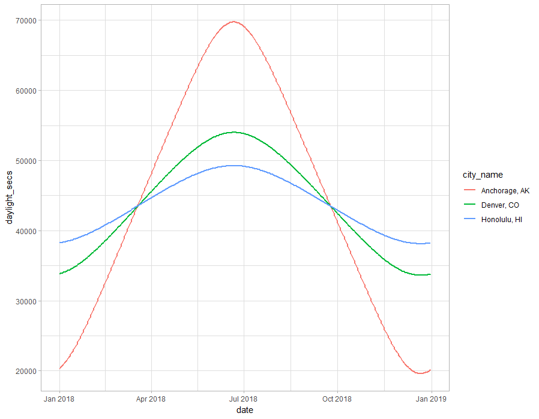
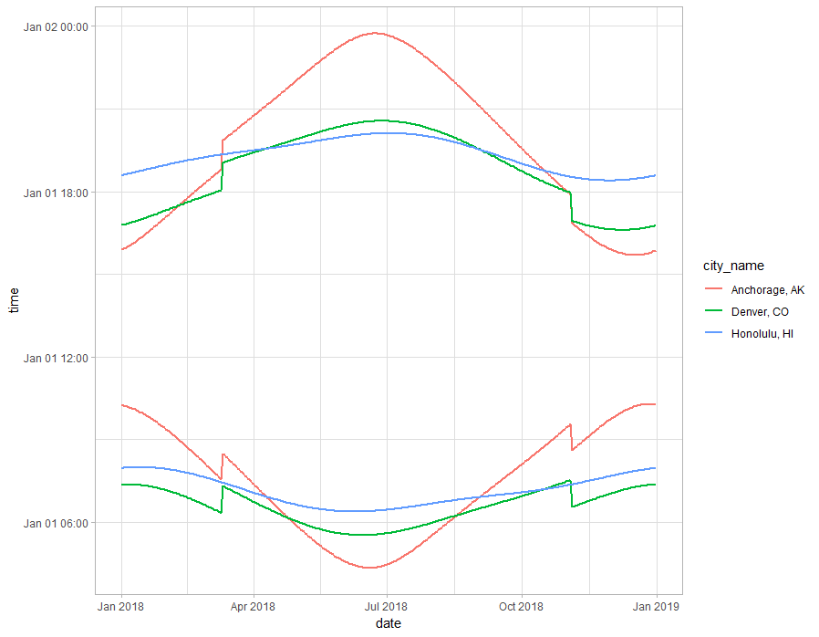

# suncalc in R

After listening to this article on NPR <https://www.wbur.org/hereandnow/2018/12/11/sunsets-getting-later-winter-solstice> and learning that the shortest day of the year is not the minimum sunset, I wanted to see the data. Here are some other interesting articles that I stubled upon while going down the rabbit hole.

* http://www.idialstars.com/eass.htm
* http://suncalc.net
* https://github.com/mourner/suncalc
* https://www.aa.quae.nl/en/reken/zonpositie.html
* https://cran.r-project.org/web/packages/suncalc/index.html
* https://www.timeanddate.com/sun/usa/denver

I used R and the following libraries: ggmap (get lat and long of cities), lutz (get timze zones of cities), suncalc (get sunrise and sunset times), data.table (data wrangle), and ggplot2 (graphing) to get the data, calculate the max daylight, min daylight, max sunrise, min sunrise, max sunset, and min sunset for a few cities and make a couple graphs. Here is the [R script](sun_calcs.R).

### Table of Contents
1. [Data Summary](#data-summary)
2. [Daylight Plot](#daylight-plot)
3. [Sunrise and Sunset Plot](#sunrise-and-sunset-plot)

# Data Summary
| city_name       | date       | sunrise  | sunset   | daylight         | label        | 
|-----------------|------------|----------|----------|------------------|--------------| 
| "Honolulu, HI"  | 2018-06-20 | 06:24:32 | 20:05:26 | 13 hrs. 41 mins. | max daylight | 
| "Honolulu, HI"  | 2018-12-21 | 07:53:52 | 18:29:19 | 10 hrs. 36 mins. | min daylight | 
| "Honolulu, HI"  | 2018-01-13 | 07:59:50 | 18:44:06 | 10 hrs. 45 mins. | max sunrise  | 
| "Honolulu, HI"  | 2018-06-08 | 06:23:26 | 20:01:47 | 13 hrs. 39 mins. | min sunrise  | 
| "Honolulu, HI"  | 2018-07-01 | 06:27:30 | 20:06:46 | 13 hrs. 40 mins. | max sunset   | 
| "Honolulu, HI"  | 2018-11-29 | 07:40:08 | 18:23:51 | 10 hrs. 44 mins. | min susnset  | 
| "Denver, CO"    | 2018-06-21 | 05:32:55 | 20:32:52 | 14 hrs. 60 mins. | max daylight | 
| "Denver, CO"    | 2018-12-21 | 07:19:04 | 16:39:25 | 9 hrs. 21 mins.  | min daylight | 
| "Denver, CO"    | 2018-11-03 | 07:32:12 | 17:57:06 | 10 hrs. 25 mins. | max sunrise  | 
| "Denver, CO"    | 2018-06-14 | 05:32:13 | 20:30:44 | 14 hrs. 59 mins. | min sunrise  | 
| "Denver, CO"    | 2018-06-27 | 05:34:39 | 20:33:31 | 14 hrs. 59 mins. | max sunset   | 
| "Denver, CO"    | 2018-12-07 | 07:09:16 | 16:36:20 | 9 hrs. 28 mins.  | min susnset  | 
| "Anchorage, AK" | 2018-06-21 | 04:21:17 | 23:43:44 | 19 hrs. 23 mins. | max daylight | 
| "Anchorage, AK" | 2018-12-21 | 10:15:29 | 15:42:19 | 5 hrs. 27 mins.  | min daylight | 
| "Anchorage, AK" | 2018-12-26 | 10:16:46 | 15:45:50 | 5 hrs. 30 mins.  | max sunrise  | 
| "Anchorage, AK" | 2018-06-19 | 04:21:03 | 23:43:09 | 19 hrs. 23 mins. | min sunrise  | 
| "Anchorage, AK" | 2018-06-23 | 04:21:56 | 23:43:54 | 19 hrs. 22 mins. | max sunset   | 
| "Anchorage, AK" | 2018-12-17 | 10:12:37 | 15:41:22 | 5 hrs. 29 mins.  | min susnset  | 

# Daylight Plot

# Sunrise and Sunset Plot
